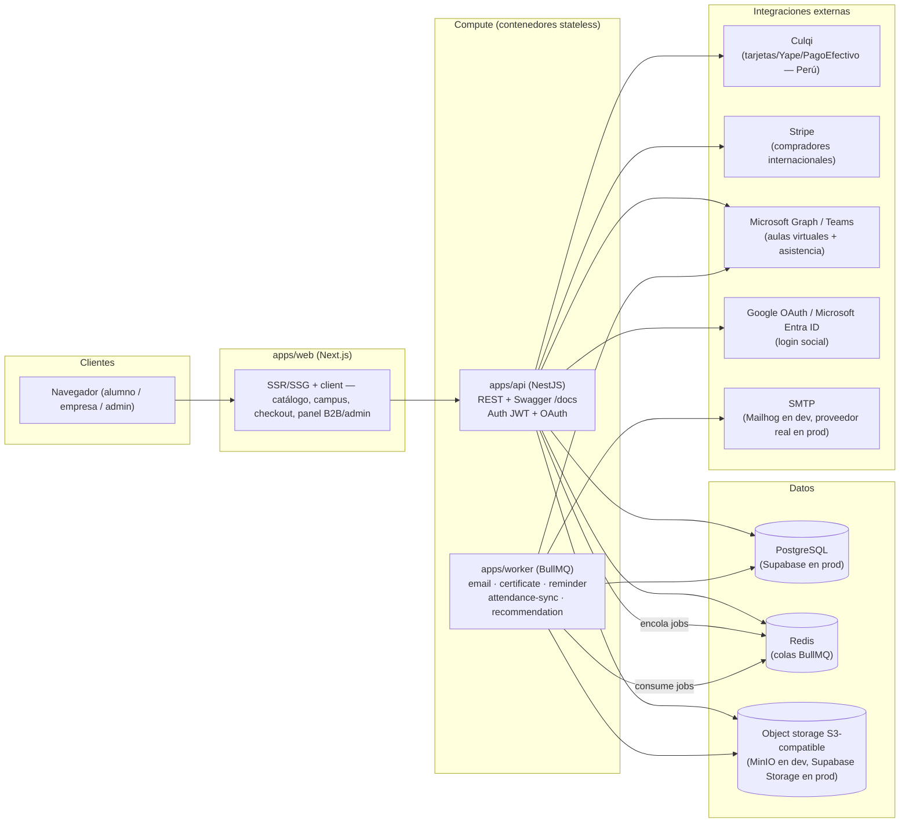

# Arquitectura — Inkademy

Inkademy es una plataforma LMS B2C + B2B (Perú/LatAm): venta directa a personas
naturales (cursos, talleres, diplomados) y venta a empresas (cupos, reportes
de avance por equipo). Este documento describe los componentes, las
decisiones técnicas y las estrategias de multi-tenancy y escalado.

## 1. Componentes

- **apps/web** (Next.js 14, App Router): catálogo público, campus del
  alumno, checkout, panel de empresa y panel de administración/soporte.
  Server-rendered para SEO en catálogo público; resto client-heavy con
  `fetch` al API.
- **apps/api** (NestJS): única fuente de verdad de reglas de negocio y
  seguridad (auth, checkout, matrícula, evaluación, certificación, B2B,
  soporte, admin). Expone REST documentado con Swagger (`/docs`). Encola
  trabajo asíncrono en BullMQ en vez de hacerlo inline en el request.
- **apps/worker** (Node + BullMQ): todo lo que no debe bloquear una
  respuesta HTTP ni depender de que el usuario mantenga la pestaña abierta:
  envío de correo, generación de PDF de certificados, cálculo/reprogramación
  de recordatorios, sincronización de asistencia con Teams, y el motor de
  recomendación por reglas.
- **PostgreSQL**: base transaccional única (esquema en `prisma/schema.prisma`).
- **Redis**: exclusivamente como backend de colas BullMQ (no se usa como
  caché de sesión — los JWT son stateless).
- **Object storage S3-compatible**: videos/PDFs/certificados/adjuntos de
  soporte. MinIO en dev, **Supabase Storage** (vía su endpoint S3-compatible)
  en producción/demo pública — o S3/Azure Blob/GCS si se opta por un
  hyperscaler más adelante, vía la misma API S3.

## 2. Justificación de decisiones técnicas

| Decisión | Por qué |
|---|---|
| **Monorepo pnpm** (`apps/*`, `packages/*`) | Un solo lugar para el modelo de datos (`prisma/schema.prisma`) y los tipos/DTOs compartidos (`packages/shared`), consumidos por las 3 apps sin duplicar contratos ni arriesgar drift entre frontend/backend/worker. |
| **NestJS para la API** | Estructura modular (guards, interceptors, DI) apropiada para un dominio con muchos subsistemas (auth, catálogo, comercio, evaluación, B2B, soporte, admin) y guards de autorización transversales (`CompanyGuard`, roles). Swagger nativo para documentar el contrato en vivo. |
| **Prisma + PostgreSQL** | Modelo relacional fuerte (matrícula, evaluación, comercio, B2B) con integridad referencial real; Prisma da tipos generados que tanto `apps/api` como `apps/worker` reutilizan desde `packages/db`, evitando dos ORMs o dos esquemas. |
| **BullMQ + Redis para trabajo async** | Envío de correo, generación de PDF (puppeteer) y llamadas a Microsoft Graph son lentos o pueden fallar transitoriamente — no deben bloquear el request del usuario ni el checkout. BullMQ da reintentos, backoff y jobs delayed (recordatorios) sin infraestructura adicional. |
| **`apps/worker` separado de `apps/api`** | Permite escalar/desplegar independientemente (p.ej. más réplicas de worker en época de certificación masiva, sin escalar la API) y aislar dependencias pesadas (Chromium/puppeteer) del proceso que atiende HTTP. |
| **Next.js para el frontend** | SSR/SSG para el catálogo público (SEO, tiempo de carga en LatAm con conexiones variables) y una sola base de código para B2C, B2B y panel interno con distintos layouts por ruta. |
| **JWT de acceso + refresh en cookie httpOnly** | Stateless (escala horizontal sin sesión compartida), pero el refresh en cookie httpOnly mitiga robo de token vía XSS; el access token de vida corta limita el daño si se filtra. |
| **Zod (`packages/shared/validation.ts`) + class-validator** | Un único esquema de validación fuente de verdad reusado en formularios del frontend (react-hook-form) y como base de los DTOs de NestJS, evitando reglas de validación duplicadas y divergentes. |
| **Culqi + Stripe (adapter de pagos)** | Culqi cubre medios de pago locales peruanos (Yape, PagoEfectivo, tarjetas locales); Stripe cubre compradores internacionales/tarjetas globales. Ambos detrás de una interfaz `PaymentProvider` común en la API — agregar PayPal en Fase 2 es otro adapter, no un rediseño. |
| **Microsoft Graph/Teams para aulas virtuales** | La mayoría de clientes corporativos LatAm ya usan Microsoft 365/Teams; reutilizar Teams evita pedirle a cada alumno una cuenta nueva en una plataforma de videollamadas distinta. El mismo tenant de Azure AD sirve para "Login con Microsoft" y para crear/gestionar las reuniones. |
| **Object storage S3-compatible en vez de disco local** | Los assets (videos, PDFs, certificados) deben sobrevivir redeploys de contenedores stateless y ser servibles vía URL firmada/CDN; MinIO en dev es API-compatible con Supabase Storage (elegido para prod/demo pública) o S3/Azure Blob/GCS en prod sin cambiar código. |

## 3. Multi-tenancy B2B

Inkademy es **single-tenant en base de datos, multi-tenant a nivel de fila**
(row-level, no schema-per-tenant ni DB-per-tenant):

- Toda entidad que pertenece a una empresa lleva `companyId` (`Enrollment`,
  `CompanySeatPool`, `Order`, `SupportTicket`, `AuditLog`, `Quote`).
- La pertenencia de un usuario a una empresa vive en `CompanyMembership`
  (rol `COMPANY_ADMIN` o `PARTICIPANT`, estado `INVITED/ACTIVE/REMOVED`), y
  un mismo `User` puede tener membership en cero o una empresa (además de
  poder comprar como persona natural — B2C y B2B convivend en el mismo
  usuario).
- **Aislamiento**: toda ruta con `:companyId` pasa por un `CompanyGuard` que
  verifica membership activa antes de tocar cualquier dato de esa empresa
  (ver `docs/API-CONTRACT.md`, sección "Roles y guards"). Esto evita que un
  `COMPANY_ADMIN` de la Empresa A pueda leer datos de la Empresa B aunque
  adivine el `companyId`.
- **Cupos (`CompanySeatPool`)**: una empresa compra `seatsPurchased` para una
  oferta (curso o programa); asignar un cupo a un colaborador crea un
  `Enrollment` con `source=B2B_SEAT` e incrementa `seatsUsed` — no se
  duplica el catálogo por empresa, se reutiliza el mismo `Course`/`Program`.
  Elegimos row-level en vez de schema-per-tenant porque el catálogo, las
  evaluaciones y los certificados son compartidos entre B2C y B2B (un mismo
  curso se vende suelto o por cupos), y el volumen esperado por empresa
  (decenas a cientos de colaboradores) no justifica el costo operativo de
  aislar esquemas o bases de datos por cliente.
- Los reportes agregados por empresa (`GET /companies/:id/reports`) se
  calculan siempre filtrando por `companyId`, nunca exponiendo agregados
  cross-tenant.

## 4. Estrategia de escalado

- **API stateless detrás de un load balancer**: `apps/api` no guarda estado
  en memoria entre requests (JWT verifica firma, no sesión en servidor) →
  se puede correr N réplicas detrás de un LB (ALB/NGINX/Ingress) y escalar
  horizontalmente sin sticky sessions.
- **Trabajo pesado o lento fuera del request-response**: certificación (PDF
  + QR + upload S3), envío de correo, llamadas a Microsoft Graph y el motor
  de recomendación corren en `apps/worker`, consumido desde colas BullMQ.
  Esto absorbe picos (p.ej. fin de un curso masivo que dispara cientos de
  certificados) sin degradar la latencia de la API; `apps/worker` escala
  horizontalmente ajustando `concurrency` por cola y el número de réplicas.
- **Base de datos**: PostgreSQL administrado en producción — **Supabase**
  (Postgres + Storage administrados; no se usa Supabase Auth/SDK, la
  autenticación sigue siendo JWT propio en `apps/api`) es la opción elegida
  para producción/demo pública por simplicidad operativa; el motor sigue
  siendo PostgreSQL puro, así que migrar a RDS/Cloud SQL/Azure Database for
  PostgreSQL más adelante es solo cambiar `DATABASE_URL` (ver
  `docs/DEPLOYMENT.md`). Connection pooling vía el pooler de Supabase (modo
  `pgbouncer`, puerto 6543) para no agotar conexiones con N réplicas de
  API + worker; réplica de lectura si el reporting B2B empieza a competir
  con el tráfico transaccional.
- **Redis administrado** (ElastiCache/Azure Cache/Upstash) — solo backend
  de colas, sin estado de negocio, así que es reemplazable/reiniciable sin
  pérdida de datos críticos (los jobs no procesados se reintentan; el
  estado de negocio vive en Postgres).
- **Object storage con CDN delante** en producción para servir video/PDF
  sin pasar por la API — la API solo genera URLs firmadas.
- **Cachear catálogo público** (secciones curadas, listados) en el borde
  (CDN/Next.js ISR) porque cambia con poca frecuencia y es la ruta de
  mayor tráfico anónimo.

## 5. Referencias

- Contrato REST: `docs/API-CONTRACT.md`.
- Modelo de datos completo: `docs/DATA-MODEL.md`.
- Cómo pasar de docker-compose a producción: `docs/DEPLOYMENT.md`.
- Plan de fases: `docs/PHASES.md`.
