# Modelo de datos — Inkademy

Fuente de verdad: `prisma/schema.prisma`. Este documento es un mapa de
lectura rápida; para el detalle exacto de cada campo, tipo, default e índice,
revisar el schema directamente. Los atributos mostrados abajo son los más
relevantes de cada entidad (claves, foráneas y campos que definen el
comportamiento del negocio) — se omiten campos puramente informativos para
que el diagrama siga siendo legible.

## Diagrama ER completo

```mermaid
erDiagram
  User {
    string id PK
    string email
    string passwordHash
    string globalRole
    string status
    string country
  }
  OAuthAccount {
    string id PK
    string userId FK
    string provider
    string providerAccountId
  }
  Company {
    string id PK
    string legalName
    string taxIdType
    string taxId
    string country
    string status
  }
  CompanyMembership {
    string id PK
    string companyId FK
    string userId FK
    string role
    string status
  }
  Area {
    string id PK
    string slug
    json name
  }
  Subarea {
    string id PK
    string slug
    string areaId FK
  }
  Course {
    string id PK
    string slug
    string areaId FK
    string subareaId FK
    string modality
    string type
    string level
    decimal priceAmount
    string status
  }
  CourseStaff {
    string id PK
    string courseId FK
    string userId FK
    string role
  }
  CourseModule {
    string id PK
    string courseId FK
    int order
  }
  Lesson {
    string id PK
    string moduleId FK
    string contentType
    int order
  }
  Material {
    string id PK
    string lessonId FK
    string kind
  }
  LiveSession {
    string id PK
    string courseId FK
    datetime startsAt
    datetime endsAt
    string status
    string providerMeetingId
  }
  Program {
    string id PK
    string slug
    string type
    decimal priceAmount
    string status
  }
  ProgramCourse {
    string id PK
    string programId FK
    string courseId FK
    int order
  }
  Enrollment {
    string id PK
    string userId FK
    string offeringKind
    string courseId FK
    string programId FK
    string companyId FK
    string source
    string status
    float progressPct
  }
  LessonProgress {
    string id PK
    string enrollmentId FK
    string lessonId FK
    string userId FK
    bool completed
  }
  Attendance {
    string id PK
    string liveSessionId FK
    string userId FK
    datetime joinedAt
    datetime leftAt
    string source
  }
  QuestionBank {
    string id PK
    string areaId
    string name
  }
  Question {
    string id PK
    string questionBankId FK
    string assessmentId FK
    string type
    json correctAnswer
  }
  Assessment {
    string id PK
    string courseId FK
    string type
    float minScore
    int maxAttempts
  }
  AssessmentAttempt {
    string id PK
    string assessmentId FK
    string enrollmentId FK
    string userId FK
    int attemptNumber
    float score
    string status
  }
  Answer {
    string id PK
    string attemptId FK
    string questionId FK
    json response
    bool isCorrect
    string gradedById FK
  }
  ApprovalRule {
    string id PK
    string courseId FK
    float minProgressPct
    float minAttendancePct
    float minScore
  }
  CertificateTemplate {
    string id PK
    string name
    int version
    bool active
  }
  Certificate {
    string id PK
    string code
    string userId FK
    string courseId FK
    string programId FK
    string enrollmentId FK
    string templateId FK
    float finalScore
    bool revoked
  }
  Order {
    string id PK
    string userId FK
    string companyId FK
    decimal total
    string currency
    string status
  }
  OrderItem {
    string id PK
    string orderId FK
    string offeringKind
    string courseId FK
    string programId FK
  }
  Payment {
    string id PK
    string orderId FK
    string provider
    string status
    decimal amount
  }
  CompanySeatPool {
    string id PK
    string companyId FK
    string offeringKind
    string courseId FK
    string programId FK
    int seatsPurchased
    int seatsUsed
  }
  Quote {
    string id PK
    string companyId FK
    string requestedByUserId FK
    string status
  }
  CalendarEvent {
    string id PK
    string userId FK
    string liveSessionId FK
    string type
    datetime startsAt
  }
  Notification {
    string id PK
    string userId FK
    string channel
    string template
    string status
  }
  SupportTicket {
    string id PK
    string createdById FK
    string companyId FK
    string priority
    string status
  }
  SupportMessage {
    string id PK
    string ticketId FK
    string authorId FK
  }
  Recommendation {
    string id PK
    string userId FK
    string courseId FK
    string programId FK
    string reason
    float score
  }
  AuditLog {
    string id PK
    string actorId FK
    string companyId FK
    string action
    string entity
  }
  CountryConfig {
    string id PK
    string country
    string currency
    string taxIdLabel
  }

  User ||--o{ OAuthAccount : "autentica con"
  User ||--o{ CompanyMembership : "pertenece a"
  Company ||--o{ CompanyMembership : "tiene miembros"
  User ||--o{ Enrollment : "matricula"
  Company ||--o{ Enrollment : "matricula (B2B)"
  User ||--o{ Order : "compra"
  Company ||--o{ Order : "compra (B2B)"
  User ||--o{ AssessmentAttempt : "intenta"
  User ||--o{ Certificate : "recibe"
  User ||--o{ Attendance : "asiste"
  User ||--o{ LessonProgress : "avanza"
  User ||--o{ CalendarEvent : "tiene agendado"
  User ||--o{ Notification : "recibe"
  User ||--o{ SupportTicket : "crea"
  User ||--o{ SupportMessage : "escribe"
  User ||--o{ Recommendation : "recibe"
  User ||--o{ AuditLog : "genera"
  User ||--o{ CourseStaff : "enseña en"
  User ||--o{ Answer : "califica"

  Company ||--o{ CompanySeatPool : "compra cupos"
  Company ||--o{ Quote : "solicita"
  Company ||--o{ SupportTicket : "reporta"
  Company ||--o{ AuditLog : "genera"

  Area ||--o{ Subarea : "agrupa"
  Area ||--o{ Course : "clasifica"
  Subarea ||--o{ Course : "clasifica"

  Course ||--o{ CourseStaff : "tiene"
  Course ||--o{ CourseModule : "contiene"
  Course ||--o{ LiveSession : "programa"
  Course ||--o{ Assessment : "evalúa con"
  Course ||--o{ Enrollment : "matricula en"
  Course ||--o{ ProgramCourse : "integra"
  Course ||--o{ Certificate : "certifica"
  Course ||--|| ApprovalRule : "define regla"

  CourseModule ||--o{ Lesson : "contiene"
  Lesson ||--o{ Material : "adjunta"
  Lesson ||--o{ LessonProgress : "registra"

  LiveSession ||--o{ Attendance : "registra"
  LiveSession ||--o{ CalendarEvent : "agenda"

  Program ||--o{ ProgramCourse : "incluye"
  Program ||--o{ Enrollment : "matricula en"
  Program ||--o{ Certificate : "certifica"

  Enrollment ||--o{ LessonProgress : "detalla"
  Enrollment ||--o{ AssessmentAttempt : "habilita"
  Enrollment ||--|| Certificate : "emite"

  QuestionBank ||--o{ Question : "almacena"
  Assessment ||--o{ Question : "define"
  Assessment ||--o{ AssessmentAttempt : "recibe"
  Question ||--o{ Answer : "responde"
  AssessmentAttempt ||--o{ Answer : "contiene"

  CertificateTemplate ||--o{ Certificate : "renderiza"

  Order ||--o{ OrderItem : "contiene"
  Order ||--o{ Payment : "cobra"

  SupportTicket ||--o{ SupportMessage : "acumula"
```

## Explicación por bloque

### Identidad y organización
`User`, `OAuthAccount`, `Company`, `CompanyMembership`. Un `User` es la
identidad única del sistema (alumno, docente, soporte o admin según
`globalRole`); puede autenticarse con password o vía OAuth (Google/Microsoft,
`OAuthAccount`). El perfil se completa de forma progresiva (documento, país,
intereses) antes del primer pago o certificado. Una `Company` es un cliente
B2B; `CompanyMembership` vincula usuarios a empresas con un rol
(`COMPANY_ADMIN`/`PARTICIPANT`) — un mismo usuario puede comprar como
persona natural y, además, pertenecer a una empresa.

### Catálogo
`Area`, `Subarea`, `Course`, `CourseStaff`, `CourseModule`, `Lesson`,
`Material`, `LiveSession`, `Program`, `ProgramCourse`. El catálogo se navega
por área/subárea. Un `Course` tiene modalidad (grabado/vivo/híbrido), tipo
(curso/taller/seminario/masterclass/programa/diplomado/in-house) y nivel; se
estructura en `CourseModule` → `Lesson` → `Material`. Las clases en vivo
(`LiveSession`) se integran con Microsoft Teams vía Graph API. Un `Program`
(programa o diplomado) agrupa varios `Course` en orden (`ProgramCourse`) con
un precio propio, normalmente con descuento frente a comprarlos sueltos.
`prerequisiteCourseIds`/`nextRecommendedCourseIds` en `Course` son arrays
curados a mano que alimentan rutas progresivas y el motor de recomendación.

### Matrícula
`Enrollment`, `LessonProgress`, `Attendance`. Una `Enrollment` matricula a un
`User` en un `Course` o `Program` (`offeringKind`), con un origen
(`source`: compra B2C, cupo B2B, gratis, otorgada por admin) y un estado.
`LessonProgress` registra avance lección por lección (recalcula
`progressPct` del enrollment); `Attendance` registra asistencia a
`LiveSession`, poblada por `apps/worker` desde el reporte de Microsoft Graph.

### Evaluación y certificación
`QuestionBank`, `Question`, `Assessment`, `AssessmentAttempt`, `Answer`,
`ApprovalRule`, `CertificateTemplate`, `Certificate`. Un `Assessment`
pertenece a un `Course` y contiene `Question` (opción única/múltiple,
verdadero-falso, respuesta corta o abierta) tomadas directamente o desde un
`QuestionBank` compartido. Cada intento (`AssessmentAttempt`) guarda sus
`Answer`; las preguntas objetivas se autocalifican, las abiertas quedan
`PENDING_REVIEW` hasta que un docente/admin las califica. `ApprovalRule`
define, por curso, el umbral de progreso/asistencia/nota para habilitar el
certificado; `Certificate` es la emisión final (código único verificable,
snapshot de los criterios cumplidos, PDF + QR generados por
`apps/worker`) renderizada con una `CertificateTemplate`.

### Comercio
`Order`, `OrderItem`, `Payment`, `CompanySeatPool`, `Quote`. Una compra crea
un `Order` con sus `OrderItem` (curso, programa o cupos B2B) y se cobra vía
uno o más `Payment` (Culqi/Stripe/PayPal). Las empresas compran
`CompanySeatPool` (cupos por oferta) y los asignan a colaboradores, lo que
crea un `Enrollment` con `source=B2B_SEAT`. `Quote` registra solicitudes de
cotización comercial para acuerdos a medida.

### Agenda, notificaciones y soporte
`CalendarEvent`, `Notification`, `SupportTicket`, `SupportMessage`,
`Recommendation`. `CalendarEvent` alimenta el calendario del alumno (clases,
inicios de curso, vencimientos, exámenes) y el `.ics` suscribible.
`Notification` es el registro de cada envío (canal, plantilla, estado) hecho
por `apps/worker`. `SupportTicket`/`SupportMessage` son la mesa de ayuda
(propia o de empresa). `Recommendation` guarda las sugerencias generadas por
el motor de reglas, con su razón (`completed_related`, `interest_match`,
`level_progression`, `company_assigned`).

### Sistema
`AuditLog`, `CountryConfig`. `AuditLog` registra cambios sensibles
(antes/después) para trazabilidad y soporte. `CountryConfig` centraliza,
por país, los tipos de documento válidos, moneda y prefijo telefónico —
necesario para el perfil progresivo y el checkout multi-país (Perú hoy,
más países en Fase 2).
